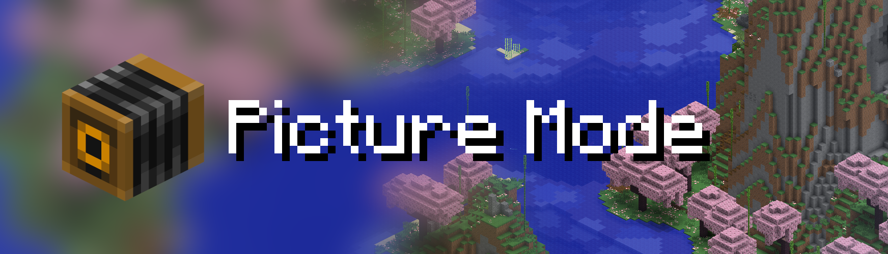
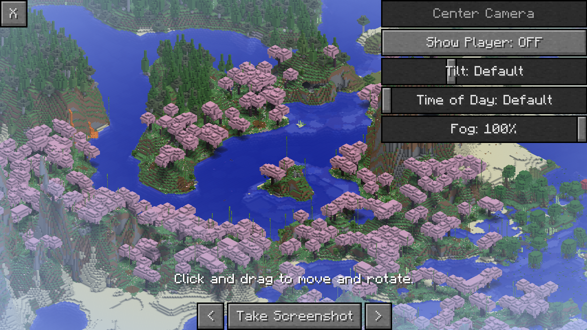

    

        
    

    

Picture Mode is a mod that adds an isometric picture taking mode to Minecraft.
It is inspired by the Photo Mode from Better than Adventure. The interface is simple to use
and the isometric perspective gives a unique way to capture images of structures.

## Features
- An isometric perspective for screenshotting
- Controls for the camera orientation
- Panning controls for advanced cropping
- Environment controls to make the image more pretty

## Screenshot
Below is a screenshot of the main interface of the mod.

## Disabling for a dimension
Server owners or modpack makers can disable Picture Mode in a dimension by adding its
dimension type to the `picturemode:disabled` tag. The button will be disabled once 
the player is in a dimension of the disabled type

## Credits
Thanks to the Better than Adventure! team for the original Photo Mode, which is a huge inspiration for this mod.